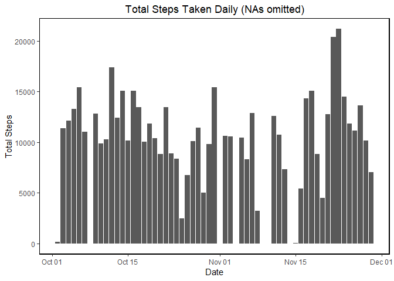
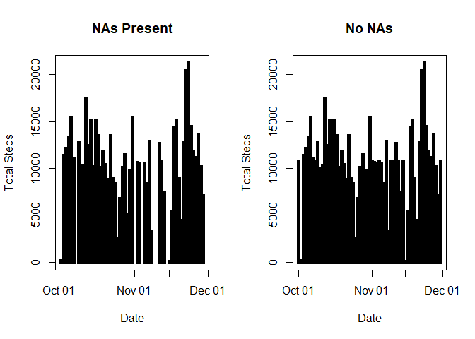

---
title: "Reproducible Research Project 1"
author: "Joshua Chu"
date: "May 10, 2019"
output: 
  html_document: 
    keep_md: yes
---  


## Loading data and libraries.

```r
library(ggplot2)
library(tidyr)
library(dplyr)

rawData <- read.csv("activity.csv")
df0<-rawData
df0$date<-as.Date(df0$date,format='%Y-%m-%d')
```

## Calculate daily steps and plot using a histogram.
Here I use ggplot to produce the histogram. All NAs in the dataset are not included.

```r
df1<-aggregate(steps~date,na.rm=TRUE,data=df0,sum)

ggplot(df1,aes(x=date)) +           
        geom_histogram(aes(y=steps),stat = 'identity',binwidth = 1,alpha=1) +
        ggtitle('Total Steps Taken Daily (NAs omitted)') +
        xlab("Date") +
        ylab("Total Steps") +
        theme(plot.title = element_text(hjust = 0.5)) +
        theme(panel.background = element_rect('white')) +
        theme(panel.border = element_rect(colour = "black", fill=NA, size=1))
```

<!-- -->

## Calculate and report the mean and median of the total number of steps taken per day.
A subset of the mean and median are reported.

```r
avg0<-aggregate(steps~date,na.rm=TRUE,data=df0,mean)
head(avg0)
```

```
##         date    steps
## 1 2012-10-02  0.43750
## 2 2012-10-03 39.41667
## 3 2012-10-04 42.06944
## 4 2012-10-05 46.15972
## 5 2012-10-06 53.54167
## 6 2012-10-07 38.24653
```

```r
med0<-aggregate(steps~date,na.rm=TRUE,data=df0,median)
head(med0)
```

```
##         date steps
## 1 2012-10-02     0
## 2 2012-10-03     0
## 3 2012-10-04     0
## 4 2012-10-05     0
## 5 2012-10-06     0
## 6 2012-10-07     0
```


## What is the average daily activity pattern?

```r
gpdf0<-group_by(df0,interval)

spAvg<-summarise(gpdf0,Avg=mean(steps,na.rm = TRUE))

ggplot(spAvg,aes(x=interval,y=Avg)) +
        geom_line(colour='blue',size=.5) +
        xlab("Interval") +
        ylab("Avg Steps") +
        theme(panel.background = element_rect('white')) +
        theme(panel.border = element_rect(colour = "black", fill=NA, size=1))
```

<!-- -->


## Inputing missing values.
1.1 Determine the total number of NAs.

```r
summary(df0)
```

```
##      steps             date               interval     
##  Min.   :  0.00   Min.   :2012-10-01   Min.   :   0.0  
##  1st Qu.:  0.00   1st Qu.:2012-10-16   1st Qu.: 588.8  
##  Median :  0.00   Median :2012-10-31   Median :1177.5  
##  Mean   : 37.38   Mean   :2012-10-31   Mean   :1177.5  
##  3rd Qu.: 12.00   3rd Qu.:2012-11-15   3rd Qu.:1766.2  
##  Max.   :806.00   Max.   :2012-11-30   Max.   :2355.0  
##  NA's   :2304
```


1.2 Use the step average to substitute for NAs. 

```r
df2$steps[is.na(df2$steps)]<-mean(df0$steps,na.rm = TRUE)
```

1.3 Create a new dataset and plot a histogram. 

```r
df3<-aggregate(steps~date,na.rm=TRUE,data=df2,sum)    

ggplot(df3,aes(x=date)) +           
        geom_histogram(aes(y=steps),stat = 'identity',binwidth = 1,alpha=1) +
        ggtitle('Total Steps Taken Daily') +
        xlab("Date") +
        ylab("Total Steps") +
        theme(plot.title = element_text(hjust = 0.5)) +
        theme(panel.background = element_rect('white')) +
        theme(panel.border = element_rect(colour = "black", fill=NA, size=1))
```

<!-- -->

A subset of the mean and median are reported.

```r
avg1<-aggregate(steps~date,na.rm=TRUE,data=df2,mean)
head(avg1)
```

```
##         date    steps
## 1 2012-10-01 37.38260
## 2 2012-10-02  0.43750
## 3 2012-10-03 39.41667
## 4 2012-10-04 42.06944
## 5 2012-10-05 46.15972
## 6 2012-10-06 53.54167
```

```r
med1<-aggregate(steps~date,na.rm=TRUE,data=df2,median)
head(med1)
```

```
##         date   steps
## 1 2012-10-01 37.3826
## 2 2012-10-02  0.0000
## 3 2012-10-03  0.0000
## 4 2012-10-04  0.0000
## 5 2012-10-05  0.0000
## 6 2012-10-06  0.0000
```

## What is the impact of imputing missing data on the estimates of the total daily number of steps?
Here I use the base plotting system to produce the histogram. 

```r
par(mfrow = c(1, 2))
plot(df1, type = "h", lwd = 5,lend = "square", main = "NAs Present",xlab='Date',ylab='Total Steps')
plot(df3, type = "h", lwd = 5, lend = "square", main = "No NAs",xlab='Date',ylab='Total Steps')
```

<!-- -->


## Are there differences in activity patterns between weekdays and weekends?
Create a new factor variable in the dataset with two levels - "weekday" and "weekend".

```r
df2$wkday<-factor(format(df3$date, "%A"))

levels(df2$wkday)<-list(weekday = c("Monday","Tuesday","Wednesday", "Thursday","Friday"),
                        weekend =c("Saturday", "Sunday"))
```
Plot using the base plotting system.

```r
par(mfrow = c(2, 1))

with(df2[df2$wkday == "weekday",], plot(aggregate(steps ~ interval, FUN = mean),
                                        type = "l", main = "Weekdays"))
with(df2[df2$wkday == "weekend",], plot(aggregate(steps ~ interval, FUN = mean),
                                        type = "l", main = "Weekends"))
```

<!-- -->

